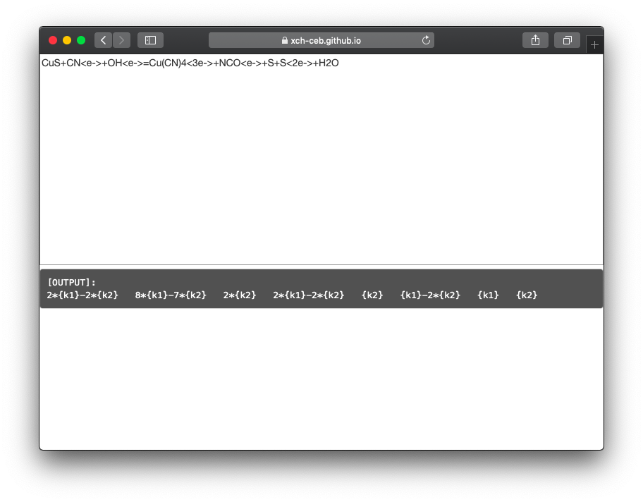

# XCH Project
 
 
  

This is XCH Project.  
It's a chemical equation balancing toolkit written in Rust language.   
[lib_xch](https://crates.io/crates/lib_xch)   
[xch-ceb](https://crates.io/crates/xch-ceb)  

# Goals of this project
Swift, Small, Safe.  

# License
Licensed under GPL-3.0  

# Plans
- [x] Uses regex-based parser
- [x] Uses Gaussian-Jordan Elimination
- [x] Provides the set of Basic Solutions
- [x] Uses AST-based parser
- [x] Supports WebAssembly
- [ ] Supports different kinds of I/O styles.